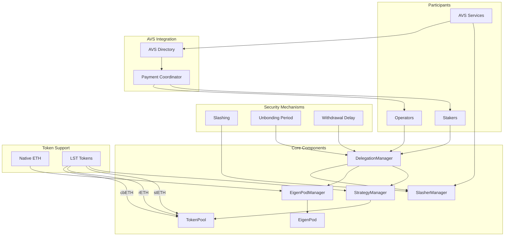

# EigenLayer-Architecture

## Architecture Diagram

```mermaid
graph TD
    subgraph "Core Components"
        A[DelegationManager] --> B[StrategyManager]
        A --> C[EigenPodManager]
        A --> D[SlasherManager]
        B --> E[TokenPool]
        C --> F[EigenPod]
    end

    subgraph "Participants"
        G[Stakers] --> A
        H[Operators] --> A
        I[AVS Services] --> D
    end

    subgraph "Token Support"
        J[Native ETH] --> C
        K[LST Tokens] --> B
        K --> |stETH| E
        K --> |rETH| E
        K --> |cbETH| E
    end

    subgraph "Security Mechanisms"
        L[Slashing] --> D
        M[Unbonding Period] --> A
        N[Withdrawal Delay] --> A
    end

    subgraph "AVS Integration"
        O[AVS Directory] --> P[Payment Coordinator]
        I --> O
        P --> G
        P --> H
    end
```
