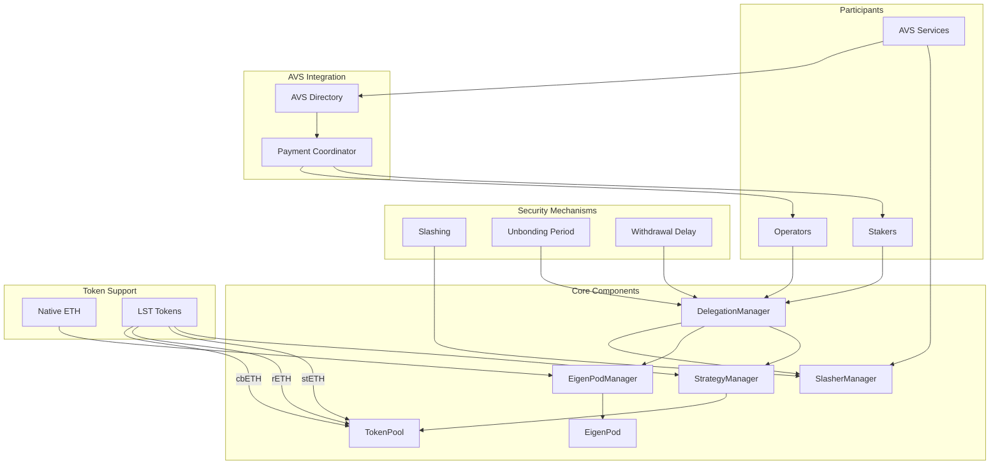
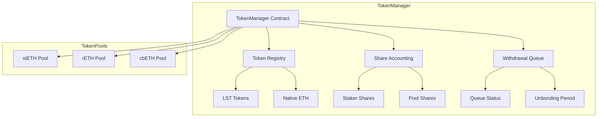
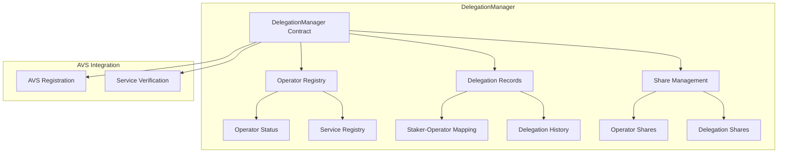
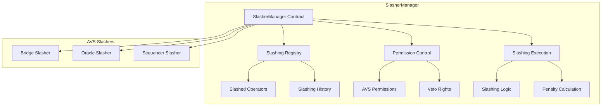
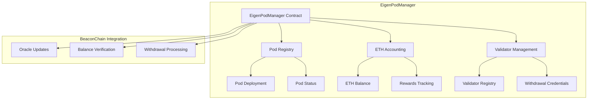
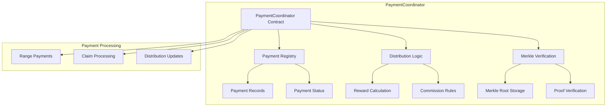

# EigenLayer-Architecture

## Architecture Diagram

## TokenManager
- Token management and share calculations
- LST token integration
- Withdrawal processing
- Share accounting system

## DelegationManager 

## SlasherManager

## EigenPod 

## PaymentCoordinator

